# T3A2-A - Full Stack App (Part A) - Larry's Lawncare

### Purpose
When it comes to a small lawn care business, the business owner may not have the capacity to hire a dedicated administrator to oversee the bookings.  
  
As the business owner will regularly be out on the road completing existing bookings, they may not be able to take calls for new bookings. The Larry's Lawncare website bridges the gap to allow a customer the self service option to make a booking online for a requested date and then allows the business to log in and manage these bookings with full CRUD operations (create/view/update and delete bookings).

The services page allows for a customer to see if Larry's Lawncare offers the services they need and then allows them the option to book the service, alleviating the need for follow up phone calls for any missed calls. It also allows the customer to make the booking at a time that is most convenient for them, not necessarily in business hours.

### Functionality / Features
* Business Owner Login
* Booking request form
* Contact Us page
* CRUD functionality for bookings
* Reschedule option for recurring bookings 
* Services list

### Target audience
Larry's Lawncare website is aimed at people who are needing assistance with cleaning up or maintaining their lawn and would like the ease of being able to book online hassle free.

### Tech stack

**Design & Planning**
* Trello
* Lucid Chart
* Adobe XD
* Indesign

**Source Control**
* Git
* Github (Hosting repository)

**Frontend**
* HTML
* CSS
* JavaScript
* React JS

**Backend**
* Rails API

**Database**
* PostgreSQL

**Deployment**
* Frontend - Netlify
* Backend - Heroku

**Testing**
* App testing - TBA
* Postman

### Dataflow Diagram
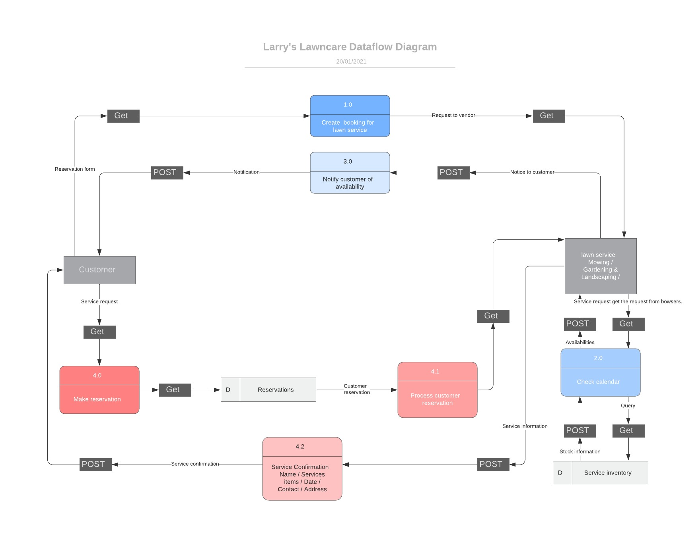

### Application Architecture Diagram

#### User Stories

**User Stories**
* As a customer, I want to be able to complete a booking form so that I can make a booking for a lawn service
    * Revised: Add autocomplete option onto address fields so that customer has a faster and more simplified booking experience
    * Revised edit: Autocomplete option a 'nice to have' feature - will implement if all other features work as expected.
* As a customer, I want to be able to contact the company so that I can confirm/cancel my appointment
* As a prospective customer, I want to be able to view a service list so that I can see prices and check that the business caters to my lawn requirements
* As a prospective customer, I want to be able to view examples of the business' work so that I can see the quality of their work and choose whether I book with them
    * Revised: Testimonials added to services page so that customers can read about quality of work. Links to social media platforms also added.
* As a business owner, I want to have a user friendly website so that my existing and potential new clients can make a booking and contact the business easily
* As a business owner, I want to be able to securely log on to the website so that I can view and manage (create/update/delete) my clients bookings accordingly
    * Revised: Also to update services offered along with their pricing so any price changes can be managed accordingly.
* As a business owner, I want my customers to have the ability to make their own booking online and select their service type so that I have their details recorded in the database and so they can make the booking at any time
* As a business owner, I want to ensure that only the areas which are serviceable can be booked so the business does not receive a booking for a location which is not serviced
* As a business owner, I want to be able to retrieve a list of bookings for a specified day so that I can see what jobs I have for that day and plan my day accordingly
* As a business owner, I want to be able to update my services list so that my prices and services are up to date
* Added: As a user, I want to access a website with a responsive layout so I can easily use the website on a number of devices

### Wireframes for multiple standard screen sizes, created using industry standard software
 
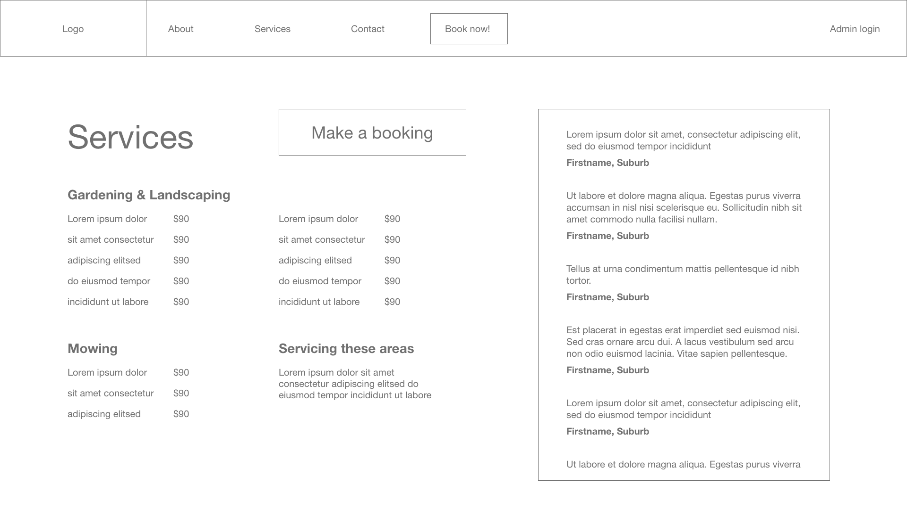 
 
 
 
 
 
 
 

 
 
 
 
 
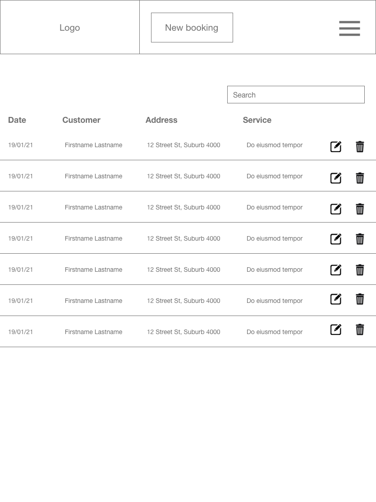 
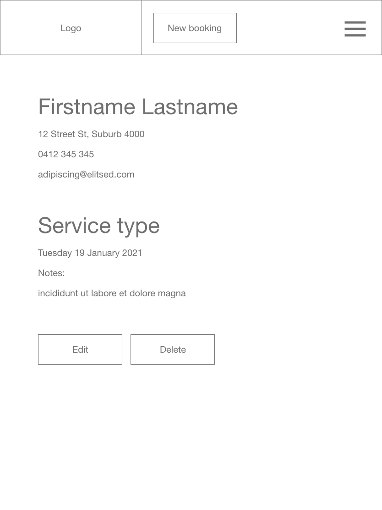 
 
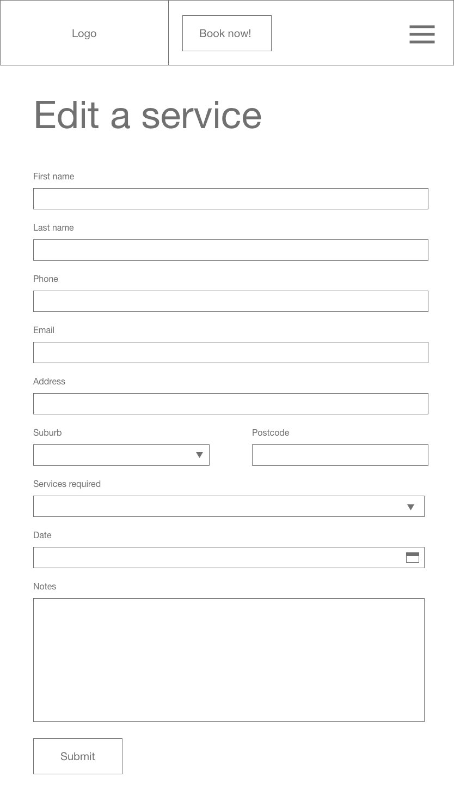 

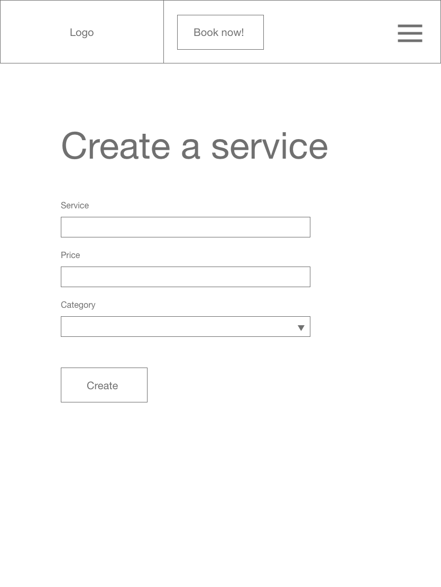
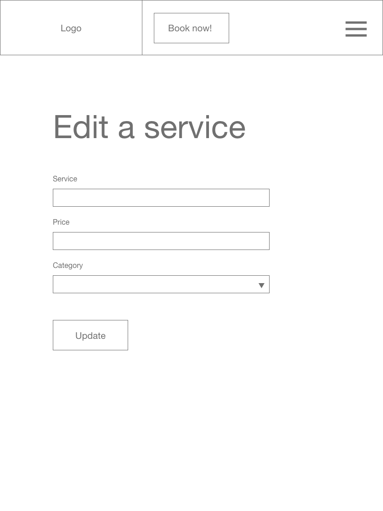

 
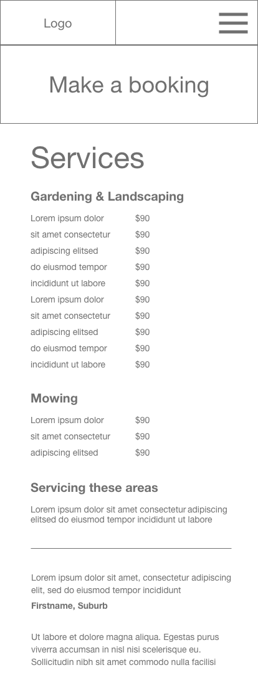 
 
 
 
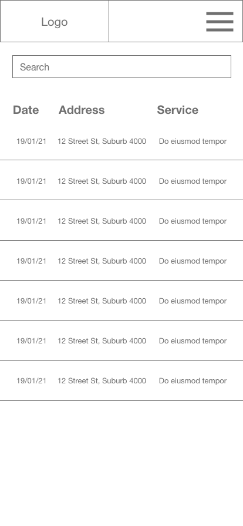 
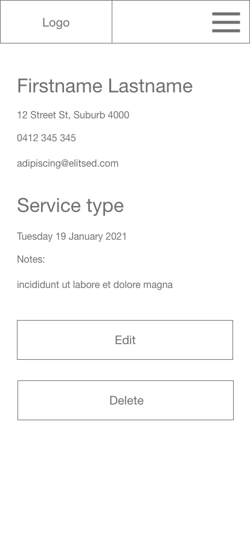 
 
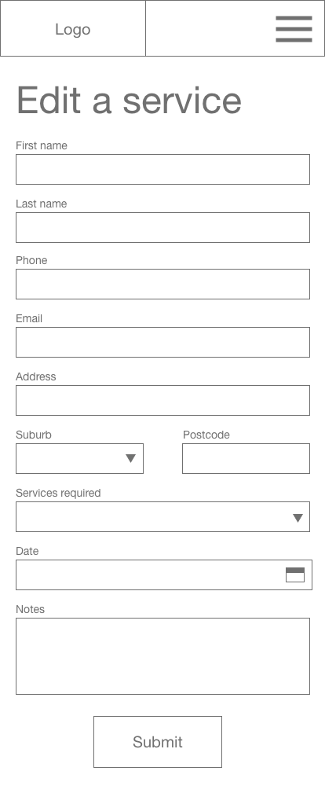 

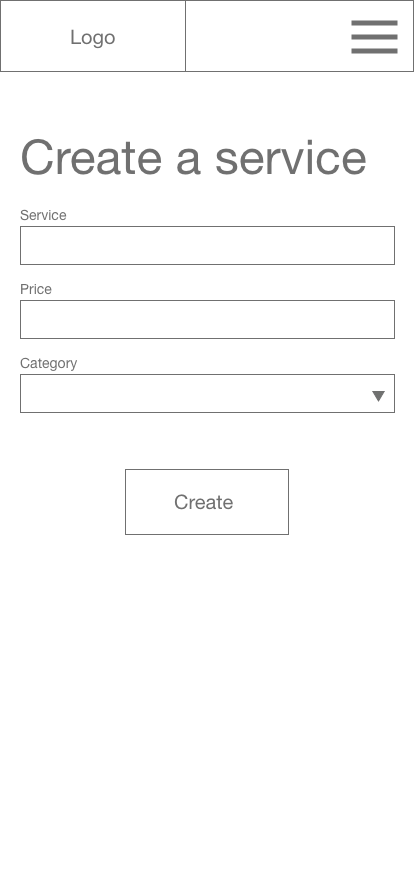

#### Site walkthrough
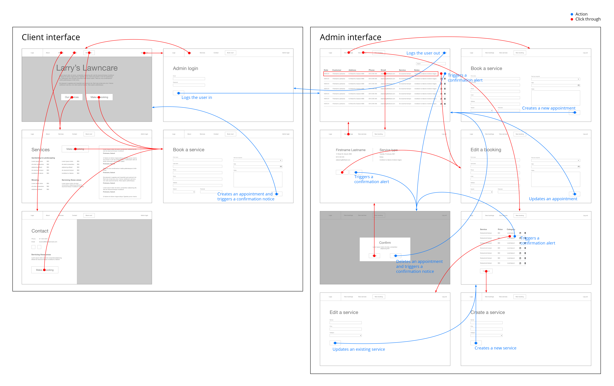

#### Client changes

1. Client requested a search bar to be added on the view all bookings page. Client requested the time column be removed as they cannot guarantee appointment times.
2. Client requested the time field be removed from the form on the booking page. The submit button for the booking form had been omitted.
3. The login button had been omitted on the Admin login page.
4. Client requested a section for testimonials be added. The image on the services page was replaced with a scrolling testimonials section.
5. Client requested social media icons be added to the contact page.
6. Client stated that the view all bookings page for tablet was too crowded. Font size was reduced to allow for more white space.

### Project Management Implementation
For this project, the Agile methodology was implemented. The management tool which we used to document the tasks was Trello.  
The initial step was to have a brief on the first steps of planning and delegating. User Stories, Wireframes, Dataflow Diagram and the Application Architecture Diagram were the initial priorities.

The tasks were broken up into 4 different colour coded statuses to simplify the workflow:
1. To do (work which has not yet been started)
2. In progress (work which is actively being worked on)
3. Completed (work which has been deemed as done)
4. On hold/issues (any work which has been started on, however; is unable to progress any further due to awaiting feedback/assistance)

To ensure that the whole team was across the application requirements, all planning/features and functionality were added to the above 4 statuses and the user stories were given an initial not implemented status on Trello and once a functionality has been completed that met the user story, it would be updated to implemented status.

Each morning, the team will have a brief catch up to discuss what they have worked on, what they will be working on and what needs to be worked on next. 

### Screenshots of Trello board throughout the duration of the project
Link to Trello: https://trello.com/b/uraS52xC/t3a2-react-app

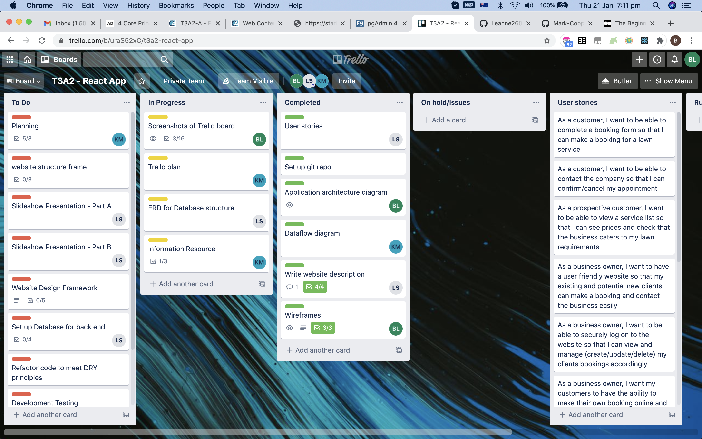

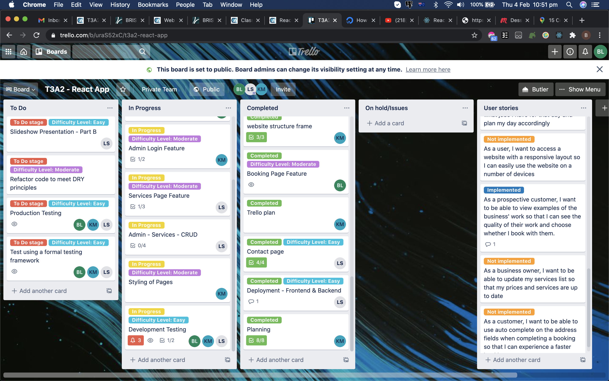

### ERD Diagram for Database Structure

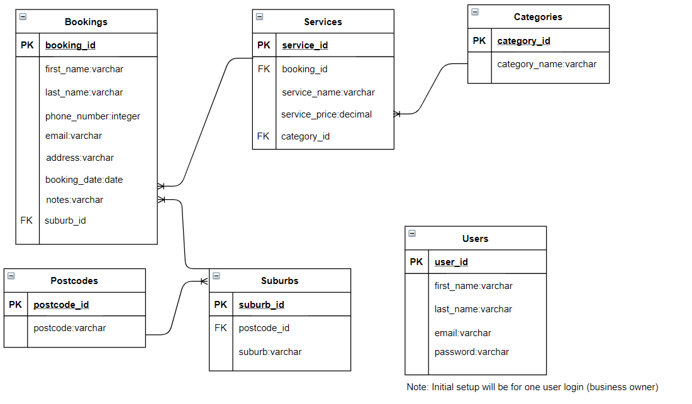